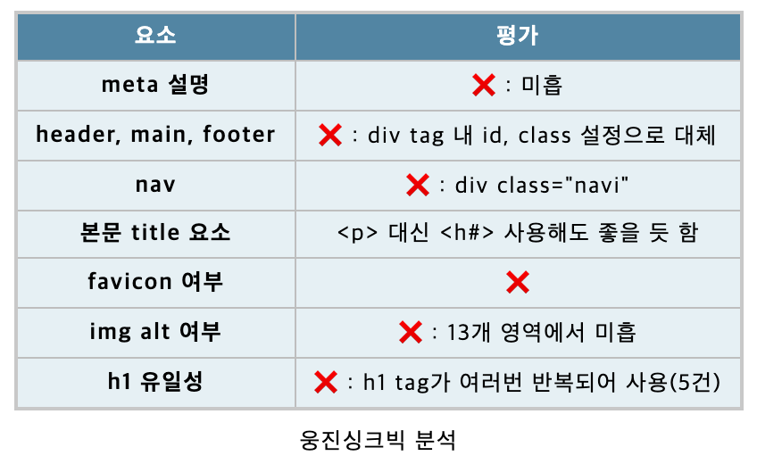

# week2

## 시맨틱 태그를 사용하는 이유
1. 검색 엔진 최적화: 시맨틱 태그를 사용하면 검색 엔진이 웹 페이지를 이해하고 색인화하는 데 도움이 되며, 더 나은 검색 결과를 제공할 수 있다.
2. 웹 접근성: 웹 페이지의 구조와 의미를 명확히 전달할 수 있어 시각 장애인 등 웹 접근에 어려움을 겪는 사람들이 웹 콘텐츠에 쉽게 접근할 수 있도록 한다.
3. 코드 유지 및 재사용성: 코드의 가독성이 향상되고 유지보수가 용이해진다. 그리고 개발자들이 코드를 더 쉽게 이해하고 다른 사람들과 협업할 수 있다.
4. 사용자 경험 향상: 사용자들이 웹 콘텐츠를 쉽게 이해하고 탐색할 수 있으며, 사용자들의 경험을 향상시키고 사용자들이 웹 페이지에서 필요한 정보를 더 빠르게 찾을 수 있도록 도와준다.
5. 미래 호환성: 추후 새로운 웹 표준이 도입되거나 브라우저가 업데이트될 때, 변경 사항에 대한 호환성을 유지하고 새로운 기능을 쉽게 적용할 수 있다.
